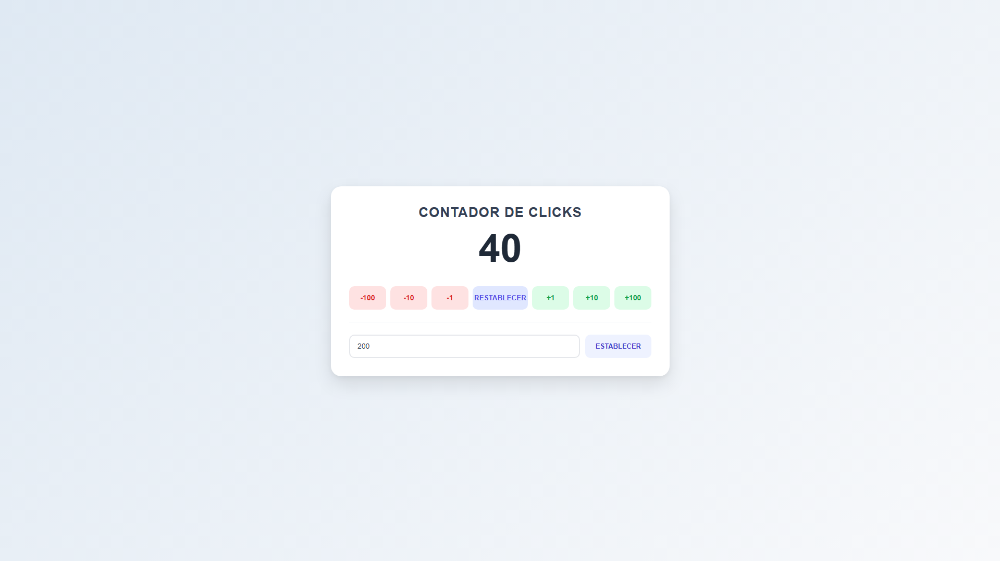

# 🖱️ Contador de Clicks
Este es mi primer proyecto aplicando mis conocimientos, usé la IA para modificar y aprender lo que vendría siendo el DRY: Dont Repeat Yourself, tenía mucho código repetido y esa no era la IDEA. Con la Inteligencia Artificial logré aprender porque existe cada linea de codigo dentro de mi script, no es la grán cosa pero me ayuda para desarrollarme como programador :)

## 📖 Descripción
Este proyecto trata de un contador de clicks sencillo, no hay mucho que explicar.

## 📄 ¿Como funciona?
Clickeas según los clicks que quieras añadir o tenes atajos de cada botón:
- -100: -
- -10: .
- -1: ,
- Restablecer: Esc
- +1: 1
- +10: 2
- +100: 3
- Establecer: Enter (Sirve para una vez colocado el número)

## 🛠️ Herramientas usadas:
### Frontend:
- HTML5
- CSS3
- JavaScript

### Backend:
- Es un proyecto simple, no se usó

## ⏰ Lo que noté y mejoré
- El primer README que creé lo hice como si hubiera terminado el proyecto desde el primer commit, cosa que está mal
- En el proyecto gracias al DRY tuve que aplicar cosas que aun no sabía, le pregunte a la IA y entendí el porque estaba ahí cada linea
- Entendí para que sirven los argumentos de las funciones

